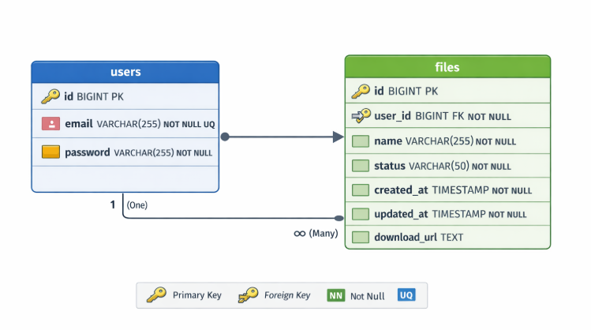
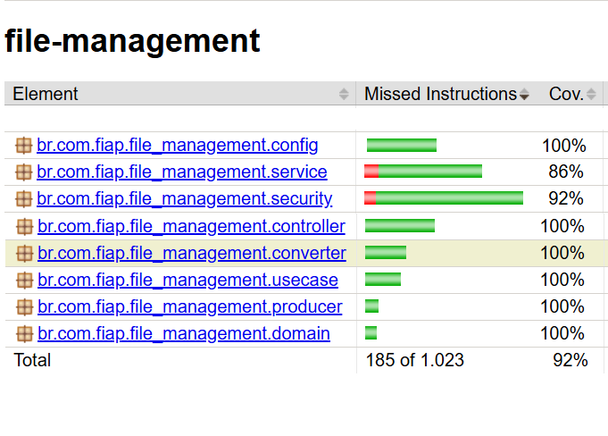
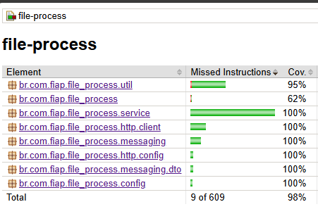

# Sistema de Processamento de Vídeos

Este projeto é uma solução de alta performance desenvolvida para o processamento de vídeos. O sistema permite que usuários façam upload de vídeos, que são processados para extração de frames (imagens) e consolidados em arquivos .zip. Esses arquivos são armazenados em um bucket seguro no Amazon S3.

## 🧩 Design Orientado a Domínio (DDD) e Fluxo de Eventos
Para a concepção do sistema, aplicamos conceitos de DDD e Event Storming para mapear o comportamento da aplicação e garantir que os requisitos de negócio fossem atendidos de forma desacoplada.


### **Explicação do Fluxo de Domínio:**

1. **Agregado de Autenticação:**
    * O fluxo inicia com o cadastro e login do usuário, garantindo o requisito de proteção por senha.
    * **Eventos-Chave:** `Usuário cadastrado` e `Usuário logado`.

2. **Agregado de Processamento:**
    * É o coração do domínio. O comando `Usuário faz upload do vídeo` dispara o processamento assíncrono.
    * **Políticas (POL):** Implementamos a política de que o sistema não deve perder requisições em picos e deve permitir múltiplos processamentos simultâneos.
    * **Eventos-Chave:** `Vídeo foi processado`, `Arquivo .zip foi gerado` e `Status dos vídeos listados`.

3. **Agregado de Notificação:**
    * Atuando como um *Side Effect* do processamento, este domínio entra em ação caso o evento `Falhou no processamento` seja disparado.
    * **Comando:** `Enviar notificação de erro`, que resulta no evento final `Notificação de erro enviada`.

---


## 🏗️ Arquitetura do Sistema
O sistema é dividido em dois microsserviços e gerenciado pela infraestrutura:

<b> File-Management - API Gateway</b>

* Responsável por autenticação de usuários, gerenciamento de arquivos e armazenamento de metadados no PostgreSQL.

* Expõe APIs REST para upload, listagem e download de arquivos.

* Utiliza JWT para autenticação e autorização.

<b> File-Process - Worker de Processamento</b>

* Responsável pelo processamento de vídeos enviados.

* Extrai frames usando JavaCV (FFmpeg) e gera um .zip.

* Armazena o arquivo processado no Amazon S3.

* Emite eventos para notificação de sucesso ou falha.

<b> Infraestrutura </b>

* Bucket S3 criado via Terraform no repositório de infraestrutura.

* Deployment de ambos os microsserviços via Kubernetes.

* Mensageria gerenciada pelo RabbitMQ em container/CloudAMQP.

* Banco de dados relacional PostegreSQL

## O projeto segue boas práticas de arquitetura de software, com foco em:

* Escalabilidade: Processamento assíncrono e microsserviços desacoplados.

* Segurança: Proteção de endpoints via JWT e armazenamento seguro de credenciais.

* Qualidade de Software: Testes unitários, limpeza de arquivos temporários e tratamento de erros.

* Resiliência: Mensageria assíncrona garante que requisições não sejam perdidas durante picos de acesso.


## 🔄 Fluxo de Eventos

O sistema segue uma arquitetura orientada a eventos (EDA):

1. Usuário faz upload do vídeo via file-management.

2. Evento é enviado ao RabbitMQ.

3. file-process consome o evento, processa o vídeo e envia o arquivo para o S3.

4. Status do processamento é atualizado em file-management.

5. Notificação de erro ou sucesso é enviada ao usuário (Mailhog local / SES produção).

## 📦 Componentes Técnicos
| Componente             | Tecnologia                     |
| ---------------------- | ------------------------------ |
| Linguagem              | Java 21                        |
| Framework              | Spring Boot 3.x                |
| Processamento de Vídeo | JavaCV (FFmpeg)                |
| Mensageria             | RabbitMQ (CloudAMQP)           |
| Banco de Dados         | PostgreSQL + Redis (cache)     |
| Armazenamento          | AWS S3                         |
| Notificação            | AWS SES / SMTP (Mailhog local) |
| Contêineres            | Docker + Kubernetes            |
| CI/CD                  | GitHub Actions                 |
| Testes                 | JUnit 5 + Mockito              |


## 🔐 Autenticação e Segurança

* A API utiliza JWT para proteger endpoints.

* Senhas são armazenadas de forma segura (hash Bcrypt).

* Tokens possuem expiração de 1 hora.


## 💾 Diagrama de Entidade - Banco de dados - Relacionamento 



## 🚀 CI/CD e Deploy Automático

O projeto conta com pipeline de CI/CD configurado via GitHub Actions, garantindo que cada alteração no repositório seja automaticamente:

Buildada: As imagens Docker dos microsserviços (file-management e file-process) são geradas automaticamente.

Testada: Todos os testes unitários e coverage são executados para garantir a qualidade do código.

Versionada: As imagens recebem tags de versão baseadas no commit/branch.


## 📂 API File Management
| Endpoint                       | Método | Descrição                                           |
| ------------------------------ | ------ | --------------------------------------------------- |
| `/v1/files/upload`             | POST   | Upload de arquivo de vídeo                          |
| `/v1/files/list`               | GET    | Lista arquivos de um usuário (filtrável por status) |
| `/v1/files/update-status/{id}` | PATCH  | Atualiza status de um arquivo                       |
| `/v1/files/{id}`               | GET    | Faz download do arquivo processado (zip)            |


## 🛠️ Configuração

### 1. Docker Compose

Execute o ambiente completo com Docker Compose:

```bash
docker-compose up -d
```

### 2. Executar a Aplicação

```bash
./mvnw spring-boot:run
# ou
./gradlew bootRun
```

A aplicação estará disponível em `http://localhost:8080`

## 🔐 Autenticação

A API utiliza JWT (JSON Web Tokens) para autenticação.

### Endpoints de Autenticação

#### Registrar Novo Usuário

<b>Endpoints de Autenticação:</b>
| Endpoint         | Método | Corpo                                                        | Descrição                   |
| ---------------- | ------ | ------------------------------------------------------------ | --------------------------- |
| `/auth/register` | POST   | `{ "email": "usuario@exemplo.com", "password": "senha123" }` | Registrar novo usuário      |
| `/auth/login`    | POST   | `{ "email": "usuario@exemplo.com", "password": "senha123" }` | Realiza login e retorna JWT |


**Resposta:**
- `200 OK` - Usuário criado com sucesso
- `400 Bad Request` - Email já existe ou dados inválidos

#### Login

**POST** `/auth/login`

```json
{
  "email": "usuario@exemplo.com",
  "password": "senha123"
}
```

**Resposta:**
```json
{
  "token": "eyJhbGciOiJIUzI1NiIsInR5cCI6IkpXVCJ9..."
}
```

### Usando o Token JWT

Para acessar endpoints protegidos, inclua o token no header Authorization:
```
"Authorization: Bearer SEU_TOKEN_AQUI"
```

## 🚨 Importante

- O token JWT expira em 1 hora
- Após a expiração, é necessário fazer login novamente
- Emails devem ser únicos no sistema
- Senhas são validadas e criptografadas automaticamente


## 📧 Sistema de Notificações de Erro
Para cumprir o requisito de notificação em caso de erro, implementamos um serviço de e-mail resiliente:

* **Resiliência:** O envio é feito de forma **Assíncrona (`@Async`)**, garantindo que uma falha no servidor de e-mail não interrompa o fluxo principal.
* **Ambiente de Desenvolvimento (Local):** Configurado para utilizar o protocolo **SMTP** integrado ao **Mailhog**. Isso permite que os desenvolvedores validem o disparo e o conteúdo dos e-mails em tempo real através de uma interface web local (`http://localhost:8025`), sem a necessidade de uma conta de e-mail real ou conexão externa.
* **Ambiente de Produção (Cloud):** A arquitetura foi projetada para integração nativa com o **Amazon SES (Simple Email Service)** via SDK da AWS, garantindo alta escalabilidade e segurança.
  > **Nota Técnica:** A implementação completa do SES não foi habilitada neste momento devido às restrições do **AWS Academy**, que limita o acesso a este serviço específico. Portanto, o projeto utiliza o provedor SMTP como uma abstração perfeitamente substituível para o ambiente produtivo.
* **UX (User Experience):** O sistema captura erros técnicos (ex: arquivo corrompido ou codec inválido) e os traduz em mensagens amigáveis para o usuário final, ocultando caminhos de diretórios e logs internos.

---

## 💡 Boas Práticas Implementadas e Qualidade

Limpeza de arquivos temporários após processamento.

Tratamento de erros amigável para o usuário.

Validação de arquivos e rejeição de uploads inválidos.

Mensageria garante que requisições não sejam perdidas.

Separação de responsabilidades entre microsserviços.

Testes unitários com mocks para evitar dependências externas.

## 🧪 Executando Testes

Para rodar os testes unitários e garantir a integridade do código:

```bash
./gradlew test
```

Com coverage:
```bash
.\gradlew clean test jacocoTestReport
```

## Testes unitários - Coverage:




## 📌 Links Úteis

[Repositório file-management](https://github.com/LucasMachadoID2/file-management)

[Repositório file-process](https://github.com/LucasMachadoID2/file-process)

[Repositório infraestrutura](https://github.com/LucasMachadoID2/file-infra)


## 🙋‍♀️ Equipe

| Nome                              | RA     | Nome Discord               |
|----------------------------------|--------|---------------------------|
| Danilo Augusto Pereira            | 364411 | Danilo Augusto - RM364411 |
| Gabriela Trindade Ferreira        | 364756 | Gabriela Ferreira - RM364756 |
| Guilherme Garcia Dos Santos Moraes| 364613 | Guilherme Garcia - RM364613 |
| Lucas Matheus Monteiro Machado    | 361059 | Lucas Machado - RM361059 |
| Marjory Bispo Matos               | 361150 | Marjory Matos - RM361150 |